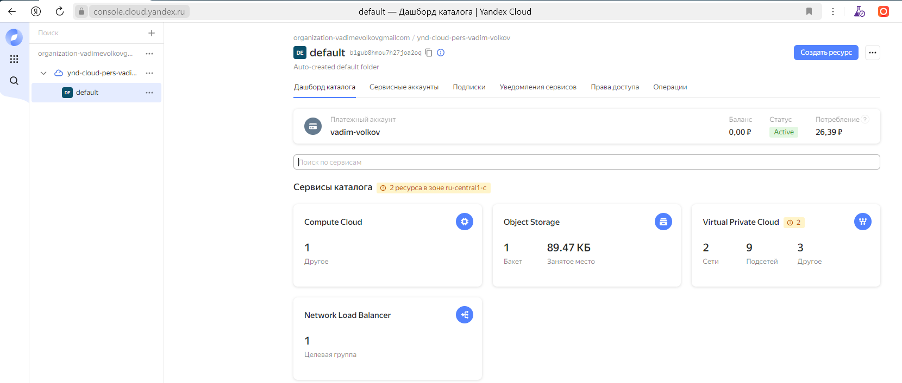
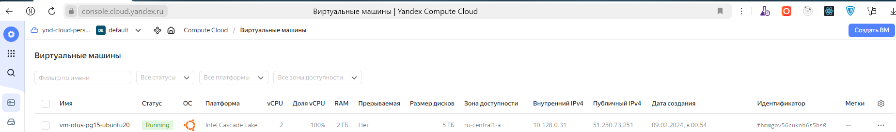
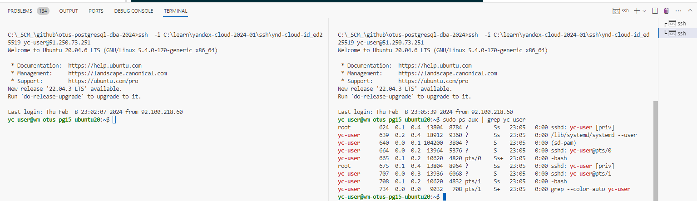
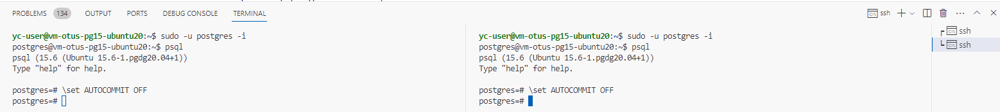
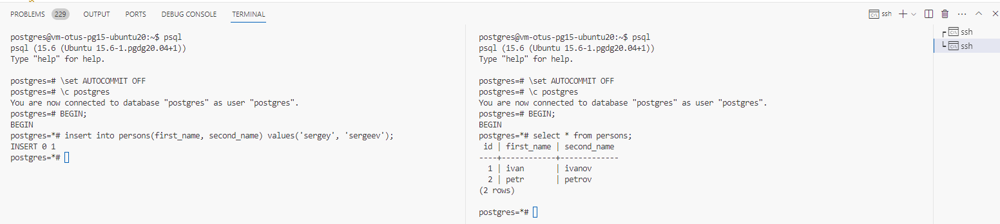
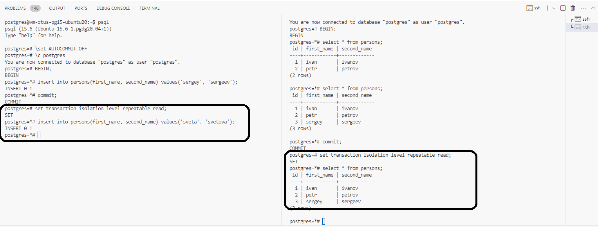
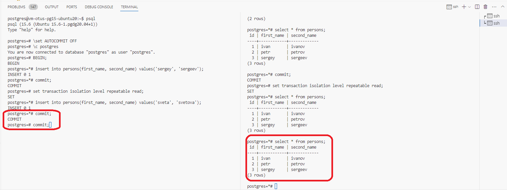
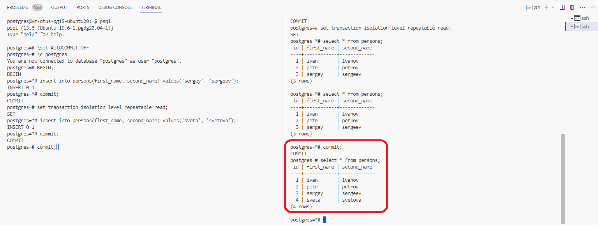

# Домашнее задание

## Работа с уровнями изоляции транзакции в PostgreSQL

### Цель

* научиться работать с Google Cloud Platform на уровне Google Compute Engine (IaaS)
* научиться управлять уровнем изоляции транзакции в PostgreSQL и понимать особенность работы уровней `read committed` и `repeatable read`

### Описание/Пошаговая инструкция выполнения домашнего задания

> * создать новый проект в Google Cloud Platform, Яндекс облако или на любых ВМ, докере

Выбран Yandex.Cloud


> * далее создать инстанс виртуальной машины с дефолтными параметрами
> * добавить свой ssh ключ в metadata ВМ

Сценарий создания:
[scripts/win/yc-create-vm.cmd](./scripts/win/yc-create-vm.cmd)

Лог выполнения:
[scripts/win/yc-create-vm-run-log.txt](./scripts/win/yc-create-vm-run-log.txt)

Скриншот консоли WebUI:


> * зайти удаленным ssh (первая сессия), не забывайте про ssh-add

```cmd
ssh  -i C:\learn\yandex-cloud-2024-01\ssh\ynd-cloud-id_ed25519 yc-user@51.250.73.251
```

> * поставить PostgreSQL

[scripts/linux/install-postgresql15-on-ubuntu20.sh](./scripts/linux/install-postgresql15-on-ubuntu20.sh)

<details>

<summary>Лог выполнения команды `sudo apt-get -y install postgresql-15`</summary>

```sh
root@vm-otus-pg15-ubuntu20:/home/yc-user# sudo apt-get -y install postgresql-15
==
Reading package lists... Done
Building dependency tree
Reading state information... Done
The following additional packages will be installed:
  libcommon-sense-perl libgdbm-compat4 libjson-perl libjson-xs-perl libllvm10 libperl5.30 libpq5 libsensors-config libsensors5 libtypes-serialiser-perl
  libxslt1.1 perl perl-modules-5.30 postgresql-client-15 postgresql-client-common postgresql-common ssl-cert sysstat
Suggested packages:
  lm-sensors perl-doc libterm-readline-gnu-perl | libterm-readline-perl-perl make libb-debug-perl liblocale-codes-perl postgresql-doc-15 openssl-blacklist
  isag
The following NEW packages will be installed:
  libcommon-sense-perl libgdbm-compat4 libjson-perl libjson-xs-perl libllvm10 libperl5.30 libpq5 libsensors-config libsensors5 libtypes-serialiser-perl
  libxslt1.1 perl perl-modules-5.30 postgresql-15 postgresql-client-15 postgresql-client-common postgresql-common ssl-cert sysstat
0 upgraded, 19 newly installed, 0 to remove and 5 not upgraded.
Need to get 41.8 MB of archives.
After this operation, 187 MB of additional disk space will be used.
Get:1 http://mirror.yandex.ru/ubuntu focal-updates/main amd64 perl-modules-5.30 all 5.30.0-9ubuntu0.5 [2,739 kB]
Get:2 http://mirror.yandex.ru/ubuntu focal/main amd64 libgdbm-compat4 amd64 1.18.1-5 [6,244 B]
Get:3 http://mirror.yandex.ru/ubuntu focal-updates/main amd64 libperl5.30 amd64 5.30.0-9ubuntu0.5 [3,941 kB]
Get:4 http://mirror.yandex.ru/ubuntu focal-updates/main amd64 perl amd64 5.30.0-9ubuntu0.5 [224 kB]
Get:5 http://mirror.yandex.ru/ubuntu focal/main amd64 libjson-perl all 4.02000-2 [80.9 kB]
Get:6 http://mirror.yandex.ru/ubuntu focal/main amd64 ssl-cert all 1.0.39 [17.0 kB]
Get:7 http://mirror.yandex.ru/ubuntu focal/main amd64 libcommon-sense-perl amd64 3.74-2build6 [20.1 kB]
Get:8 http://mirror.yandex.ru/ubuntu focal/main amd64 libtypes-serialiser-perl all 1.0-1 [12.1 kB]
Get:9 http://mirror.yandex.ru/ubuntu focal/main amd64 libjson-xs-perl amd64 4.020-1build1 [83.7 kB]
Get:10 http://mirror.yandex.ru/ubuntu focal/main amd64 libllvm10 amd64 1:10.0.0-4ubuntu1 [15.3 MB]
Get:11 https://apt.postgresql.org/pub/repos/apt focal-pgdg/main amd64 postgresql-client-common all 257.pgdg20.04+1 [94.3 kB]
Get:12 https://apt.postgresql.org/pub/repos/apt focal-pgdg/main amd64 postgresql-common all 257.pgdg20.04+1 [239 kB]
Get:13 http://mirror.yandex.ru/ubuntu focal-updates/main amd64 libsensors-config all 1:3.6.0-2ubuntu1.1 [6,052 B]
Get:14 http://mirror.yandex.ru/ubuntu focal-updates/main amd64 libsensors5 amd64 1:3.6.0-2ubuntu1.1 [27.2 kB]
Get:15 http://mirror.yandex.ru/ubuntu focal-updates/main amd64 libxslt1.1 amd64 1.1.34-4ubuntu0.20.04.1 [151 kB]
Get:16 http://mirror.yandex.ru/ubuntu focal-updates/main amd64 sysstat amd64 12.2.0-2ubuntu0.3 [448 kB]
Get:17 https://apt.postgresql.org/pub/repos/apt focal-pgdg/main amd64 libpq5 amd64 16.2-1.pgdg20.04+1 [214 kB]
Get:18 https://apt.postgresql.org/pub/repos/apt focal-pgdg/main amd64 postgresql-client-15 amd64 15.6-1.pgdg20.04+1 [1,688 kB]
Get:19 https://apt.postgresql.org/pub/repos/apt focal-pgdg/main amd64 postgresql-15 amd64 15.6-1.pgdg20.04+1 [16.5 MB]
Fetched 41.8 MB in 1s (32.1 MB/s)
Preconfiguring packages ...
Selecting previously unselected package perl-modules-5.30.
(Reading database ... 102638 files and directories currently installed.)
Preparing to unpack .../00-perl-modules-5.30_5.30.0-9ubuntu0.5_all.deb ...
Unpacking perl-modules-5.30 (5.30.0-9ubuntu0.5) ...
Selecting previously unselected package libgdbm-compat4:amd64.
Preparing to unpack .../01-libgdbm-compat4_1.18.1-5_amd64.deb ...
Unpacking libgdbm-compat4:amd64 (1.18.1-5) ...
Selecting previously unselected package libperl5.30:amd64.
Preparing to unpack .../02-libperl5.30_5.30.0-9ubuntu0.5_amd64.deb ...
Unpacking libperl5.30:amd64 (5.30.0-9ubuntu0.5) ...
Selecting previously unselected package perl.
Preparing to unpack .../03-perl_5.30.0-9ubuntu0.5_amd64.deb ...
Unpacking perl (5.30.0-9ubuntu0.5) ...
Selecting previously unselected package libjson-perl.
Preparing to unpack .../04-libjson-perl_4.02000-2_all.deb ...
Unpacking libjson-perl (4.02000-2) ...
Selecting previously unselected package postgresql-client-common.
Preparing to unpack .../05-postgresql-client-common_257.pgdg20.04+1_all.deb ...
Unpacking postgresql-client-common (257.pgdg20.04+1) ...
Selecting previously unselected package ssl-cert.
Preparing to unpack .../06-ssl-cert_1.0.39_all.deb ...
Unpacking ssl-cert (1.0.39) ...
Selecting previously unselected package postgresql-common.
Preparing to unpack .../07-postgresql-common_257.pgdg20.04+1_all.deb ...
Adding 'diversion of /usr/bin/pg_config to /usr/bin/pg_config.libpq-dev by postgresql-common'
Unpacking postgresql-common (257.pgdg20.04+1) ...
Selecting previously unselected package libcommon-sense-perl.
Preparing to unpack .../08-libcommon-sense-perl_3.74-2build6_amd64.deb ...
Unpacking libcommon-sense-perl (3.74-2build6) ...
Selecting previously unselected package libtypes-serialiser-perl.
Preparing to unpack .../09-libtypes-serialiser-perl_1.0-1_all.deb ...
Unpacking libtypes-serialiser-perl (1.0-1) ...
Selecting previously unselected package libjson-xs-perl.
Preparing to unpack .../10-libjson-xs-perl_4.020-1build1_amd64.deb ...
Unpacking libjson-xs-perl (4.020-1build1) ...
Selecting previously unselected package libllvm10:amd64.
Preparing to unpack .../11-libllvm10_1%3a10.0.0-4ubuntu1_amd64.deb ...
Unpacking libllvm10:amd64 (1:10.0.0-4ubuntu1) ...
Selecting previously unselected package libpq5:amd64.
Preparing to unpack .../12-libpq5_16.2-1.pgdg20.04+1_amd64.deb ...
Unpacking libpq5:amd64 (16.2-1.pgdg20.04+1) ...
Selecting previously unselected package libsensors-config.
Preparing to unpack .../13-libsensors-config_1%3a3.6.0-2ubuntu1.1_all.deb ...
Unpacking libsensors-config (1:3.6.0-2ubuntu1.1) ...
Selecting previously unselected package libsensors5:amd64.
Preparing to unpack .../14-libsensors5_1%3a3.6.0-2ubuntu1.1_amd64.deb ...
Unpacking libsensors5:amd64 (1:3.6.0-2ubuntu1.1) ...
Selecting previously unselected package libxslt1.1:amd64.
Preparing to unpack .../15-libxslt1.1_1.1.34-4ubuntu0.20.04.1_amd64.deb ...
Unpacking libxslt1.1:amd64 (1.1.34-4ubuntu0.20.04.1) ...
Selecting previously unselected package postgresql-client-15.
Preparing to unpack .../16-postgresql-client-15_15.6-1.pgdg20.04+1_amd64.deb ...
Unpacking postgresql-client-15 (15.6-1.pgdg20.04+1) ...
Selecting previously unselected package postgresql-15.
Preparing to unpack .../17-postgresql-15_15.6-1.pgdg20.04+1_amd64.deb ...
Unpacking postgresql-15 (15.6-1.pgdg20.04+1) ...
Selecting previously unselected package sysstat.
Preparing to unpack .../18-sysstat_12.2.0-2ubuntu0.3_amd64.deb ...
Unpacking sysstat (12.2.0-2ubuntu0.3) ...
Setting up perl-modules-5.30 (5.30.0-9ubuntu0.5) ...
Setting up libsensors-config (1:3.6.0-2ubuntu1.1) ...
Setting up libpq5:amd64 (16.2-1.pgdg20.04+1) ...
Setting up libllvm10:amd64 (1:10.0.0-4ubuntu1) ...
Setting up ssl-cert (1.0.39) ...
Setting up libgdbm-compat4:amd64 (1.18.1-5) ...
Setting up libsensors5:amd64 (1:3.6.0-2ubuntu1.1) ...
Setting up libxslt1.1:amd64 (1.1.34-4ubuntu0.20.04.1) ...
Setting up libperl5.30:amd64 (5.30.0-9ubuntu0.5) ...
Setting up sysstat (12.2.0-2ubuntu0.3) ...

Creating config file /etc/default/sysstat with new version
update-alternatives: using /usr/bin/sar.sysstat to provide /usr/bin/sar (sar) in auto mode
Created symlink /etc/systemd/system/multi-user.target.wants/sysstat.service → /lib/systemd/system/sysstat.service.
Setting up perl (5.30.0-9ubuntu0.5) ...
Setting up libjson-perl (4.02000-2) ...
Setting up postgresql-client-common (257.pgdg20.04+1) ...
Setting up libcommon-sense-perl (3.74-2build6) ...
Setting up postgresql-client-15 (15.6-1.pgdg20.04+1) ...
update-alternatives: using /usr/share/postgresql/15/man/man1/psql.1.gz to provide /usr/share/man/man1/psql.1.gz (psql.1.gz) in auto mode
Setting up postgresql-common (257.pgdg20.04+1) ...
Adding user postgres to group ssl-cert

Creating config file /etc/postgresql-common/createcluster.conf with new version
Building PostgreSQL dictionaries from installed myspell/hunspell packages...
Removing obsolete dictionary files:
'/etc/apt/trusted.gpg.d/apt.postgresql.org.gpg' -> '/usr/share/postgresql-common/pgdg/apt.postgresql.org.gpg'
Created symlink /etc/systemd/system/multi-user.target.wants/postgresql.service → /lib/systemd/system/postgresql.service.
Setting up libtypes-serialiser-perl (1.0-1) ...
Setting up postgresql-15 (15.6-1.pgdg20.04+1) ...
Creating new PostgreSQL cluster 15/main ...
/usr/lib/postgresql/15/bin/initdb -D /var/lib/postgresql/15/main --auth-local peer --auth-host scram-sha-256 --no-instructions
The files belonging to this database system will be owned by user "postgres".
This user must also own the server process.

The database cluster will be initialized with locale "en_US.UTF-8".
The default database encoding has accordingly been set to "UTF8".
The default text search configuration will be set to "english".

Data page checksums are disabled.

fixing permissions on existing directory /var/lib/postgresql/15/main ... ok
creating subdirectories ... ok
selecting dynamic shared memory implementation ... posix
selecting default max_connections ... 100
selecting default shared_buffers ... 128MB
selecting default time zone ... Etc/UTC
creating configuration files ... ok
running bootstrap script ... ok
performing post-bootstrap initialization ... ok
syncing data to disk ... ok
Setting up libjson-xs-perl (4.020-1build1) ...
Processing triggers for systemd (245.4-4ubuntu3.23) ...
Processing triggers for man-db (2.9.1-1) ...
Processing triggers for libc-bin (2.31-0ubuntu9.14) ...
==
root@vm-otus-pg15-ubuntu20:/home/yc-user#
```

</details>

> * зайти вторым ssh (вторая сессия)

```cmd
ssh  -i C:\learn\yandex-cloud-2024-01\ssh\ynd-cloud-id_ed25519 yc-user@51.250.73.251
```



> * запустить везде psql из под пользователя postgres
> * выключить auto commit



> * сделать в первой сессии новую таблицу и наполнить ее данными


```sql
create table persons(id serial, first_name text, second_name text); 
insert into persons(first_name, second_name) values('ivan', 'ivanov'); 
insert into persons(first_name, second_name) values('petr', 'petrov'); 
commit;
```

Результат выполнения команд в сессии №1:

```sql
postgres=# \c postgres
You are now connected to database "postgres" as user "postgres".
postgres=# create table persons(id serial, first_name text, second_name text); 
ert into persons(first_name, second_name) values('ivan', 'ivanov');
insert into persons(first_name, second_name) values('petr', 'petrov'); 
commit;CREATE TABLE
postgres=*# insert into persons(first_name, second_name) values('ivan', 'ivanov'); 
INSERT 0 1  
postgres=*# insert into persons(first_name, second_name) values('petr', 'petrov'); 
INSERT 0 1
postgres=*# commit;
COMMIT     
postgres=# select * from persons;
 id | first_name | second_name 
----+------------+-------------
  1 | ivan       | ivanov      
  2 | petr       | petrov      
(2 rows)
```

> * посмотреть текущий уровень изоляции:

```sql
show transaction isolation level
```


Результат выполнения команды в сессии №1:

```sql
postgres=*# show transaction isolation level;
 transaction_isolation 
-----------------------
 read committed        
(1 row)

postgres=*#
```

>* начать новую транзакцию в обоих сессиях с дефолтным (не меняя) уровнем изоляции
>* в первой сессии добавить новую запись 

```sql
insert into persons(first_name, second_name) values('sergey', 'sergeev');
```

> * сделать `select * from persons` во второй сессии

Результаты выполнения операций в 2 сессиях:




>* видите ли вы новую запись и если да то почему?


Нет, т.к. на уровне изоляции "READ COMMITTED" "грязные" вставки до коммита не м.б. видны в других сессиях к БД.

>* завершить первую транзакцию - `commit;`
>* сделать `select * from persons` во второй сессии
>* видите ли вы новую запись и если да то почему?


Да, т.к. выполнен COMMIT в первой сессии, и обе сессии имеют уровень изоляции транзакций "READ COMMITTED", см. результаты выполнения операций в 2 сессиях:


> * завершите транзакцию во второй сессии


Результат выполнения во второй сессии:
```sql
postgres=# \set AUTOCOMMIT OFF
postgres=# \c postgres
You are now connected to database "postgres" as user "postgres".
postgres=# BEGIN;
BEGIN       
postgres=*# select * from persons;
 id | first_name | second_name 
----+------------+-------------
  1 | ivan       | ivanov      
  2 | petr       | petrov      
(2 rows)

postgres=*# select * from persons;
 id | first_name | second_name 
----+------------+-------------
  1 | ivan       | ivanov      
  2 | petr       | petrov      
  3 | sergey     | sergeev     
(3 rows)

postgres=*# commit;
COMMIT     
postgres=# 
```

>* начать новые но уже repeatable read транзации - `set transaction isolation level repeatable read;`
>* в первой сессии добавить новую запись 

```sql
insert into persons(first_name, second_name) values('sveta', 'svetova');
```

>* сделать `select* from persons` во второй сессии
>* видите ли вы новую запись и если да то почему?

Нет, т.к. активный уровень изоляции транзакций обоих сессий к БД является более жестким, чем предыдущий и не предполагает видимости незафиксированных изменений между разными сессиями.
См. скриншот обеих сессий:


>* завершить первую транзакцию - commit;
>* сделать `select from persons` во второй сессии
>* видите ли вы новую запись и если да то почему?


Нет, т.к. уровень изоляции транзакций "REPEATABLE READ" требует постоянства состава множества, возвращаемого при выборке по одному и тому же предикату поиска (в нашем случае - пустому), и вторая сессия видит версию состояния БД на момент старта своей транзакции, где новой записи еще нет.
См. скриншот обеих сессий:



>* завершить вторую транзакцию
>* сделать select * from persons во второй сессии
>* видите ли вы новую запись и если да то почему?


Да, т.к. после фиксации транзакции во 2-ой сессии БД ей становится доступно согласованное состояние БД (с зафиксированными сторонними транзакциями) на момент фиксации транзакции и позднее (до момента начала следующей явной транзакции во 2-ой сессии, чего еще не случилось).
См. скриншот обеих сессий:



## Критерии оценки

### Критерии оценивания

* Выполнение ДЗ: 10 баллов
* плюс 2 балла за красивое решение
* минус 2 балла за рабочее решение, и недостатки указанные преподавателем не устранены
