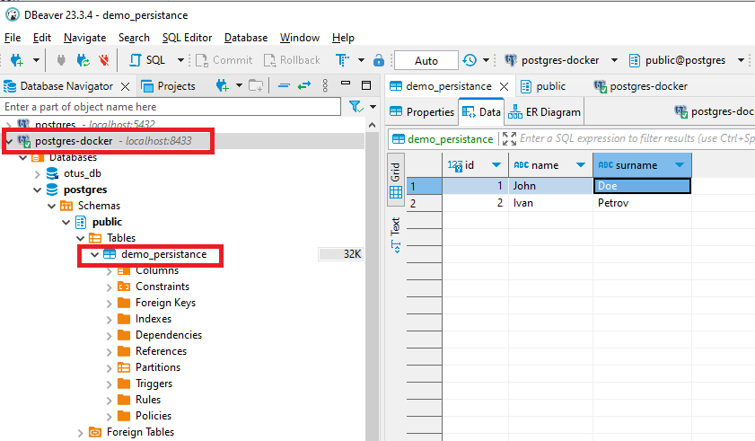

# Отчет о выполнении домашнего задания №2

Установка и настройка PostgreSQL в контейнере Docker

## Цель

* установить PostgreSQL в Docker контейнере
* настроить контейнер для внешнего подключения

## Описание/Пошаговая инструкция выполнения домашнего задания

>* создать ВМ с Ubuntu 20.04/22.04 или развернуть докер любым удобным способом
>* поставить на нем Docker Engine

Выбран вариант локальной установки Docker на ОС Windows.
Версии окружения и компонентов

```cmd
 OS version: Win10 x64 22H2 build 19045.3930

$ ver
Microsoft Windows [Version 10.0.19045.3930]
$ winver
Microsoft Windows Version 22H2 (OS Build 19045.3930)
                     
$ docker version                                                
Client:                                                         
 Cloud integration: v1.0.35+desktop.10                          
 Version:           25.0.3                                      
 API version:       1.44                                        
 Go version:        go1.21.6                                    
 Git commit:        4debf41                                     
 Built:             Tue Feb  6 21:13:02 2024                    
 OS/Arch:           windows/amd64                               
 Context:           default                                     
                                                                
Server: Docker Desktop 4.27.2 (137060)                          
 Engine:                                                        
  Version:          25.0.3                                      
  API version:      1.44 (minimum version 1.24)                 
  Go version:       go1.21.6                                    
  Git commit:       f417435                                     
  Built:            Tue Feb  6 21:14:25 2024                    
  OS/Arch:          linux/amd64                                 
  Experimental:     false                                       
 containerd:                                                    
  Version:          1.6.28                                      
  GitCommit:        ae07eda36dd25f8a1b98dfbf587313b99c0190bb    
 runc:                                                          
  Version:          1.1.12                                      
  GitCommit:        v1.1.12-0-g51d5e94                          
 docker-init:                                                   
  Version:          0.19.0                                      
  GitCommit:        de40ad0                                     

$ docker compose version
Docker Compose version v2.24.5-desktop.1
```

> * сделать каталог /var/lib/postgres
> * развернуть контейнер с PostgreSQL 15 смонтировав в него /var/lib/postgresql
> * развернуть контейнер с клиентом postgres


В качестве локального каталога хоста для монтирования к контейнеру выбран подкаталог текущего репозитория [pg-shared-data](./pg-shared-data)
Параметры контейнера с сервером и клиентом описаны в файле [docker-compose.yml](./docker/docker-compose.yml)

Контроль папки **pg-shared-data** до запуска контейнера с сервером: папка пуста

```cmd
C:\_SCM_\github\otus-postgresql-dba-2024>dir .\hw2\pg-shared-data\    
Directory of C:\_SCM_\github\otus-postgresql-dba-2024\hw2\pg-shared-data
02/15/2024  02:29 PM    <DIR>          .
02/15/2024  02:29 PM    <DIR>          ..
               0 File(s)              0 bytes
```

Запуск контейнеров сервера и клиента

```cmd
Executing task: 
docker compose -f "hw2\docker\docker-compose.yml" up -d --build 

[+] Running 2/3
 - Network docker_default              Created      11.4s 
 ✔ Container docker-pg-db-server-1     Healthy     11.1s 
 ✔ Container docker-pg-client-1        Started     11.3s
```

Контроль папки **pg-shared-data** после запуска контейнера с сервером: созданы файлы конфигурации и данных PostgreSQL:

```cmd
C:\_SCM_\github\otus-postgresql-dba-2024>dir .\hw2\pg-shared-data\                                          

Directory of C:\_SCM_\github\otus-postgresql-dba-2024\hw2\pg-shared-data
02/15/2024  02:36 PM    <DIR>          .
02/15/2024  02:36 PM    <DIR>          ..
02/15/2024  02:36 PM    <DIR>          base
02/15/2024  02:38 PM    <DIR>          global
02/15/2024  02:36 PM    <DIR>          pg_commit_ts
02/15/2024  02:36 PM    <DIR>          pg_dynshmem
02/15/2024  02:36 PM             4,821 pg_hba.conf
02/15/2024  02:36 PM             1,636 pg_ident.conf
02/15/2024  02:36 PM    <DIR>          pg_logical
02/15/2024  02:36 PM    <DIR>          pg_multixact
02/15/2024  02:36 PM    <DIR>          pg_notify
02/15/2024  02:36 PM    <DIR>          pg_replslot
02/15/2024  02:36 PM    <DIR>          pg_serial
02/15/2024  02:36 PM    <DIR>          pg_snapshots
02/15/2024  02:36 PM    <DIR>          pg_stat
02/15/2024  02:36 PM    <DIR>          pg_stat_tmp
02/15/2024  02:36 PM    <DIR>          pg_subtrans
02/15/2024  02:36 PM    <DIR>          pg_tblspc
02/15/2024  02:36 PM    <DIR>          pg_twophase
02/15/2024  02:36 PM                 3 PG_VERSION
02/15/2024  02:36 PM    <DIR>          pg_wal
02/15/2024  02:36 PM    <DIR>          pg_xact
02/15/2024  02:36 PM                88 postgresql.auto.conf
02/15/2024  02:36 PM            29,525 postgresql.conf
02/15/2024  02:36 PM                36 postmaster.opts
02/15/2024  02:36 PM                94 postmaster.pid
               7 File(s)         36,203 bytes
              19 Dir(s)                 
```


> * подключится из контейнера с клиентом к контейнеру с сервером и сделать таблицу с парой строк

Контейнер с клиентом уже подключен к контейнеру с сервером благодаря работе Docker Compose и внедренной команде:

```yml
  pg-client:
    image: postgres:15
    command: psql -h pg-db-server -U postgres
```

Подключение к контейнеру с уже поднятой сессией к БД из **psql**

```sh
C:\_SCM_\github\otus-postgresql-dba-2024>docker container attach 72b4a88c1dcb6b27f413da7a20fc83e77eb9ffbe10f52ad59cba79b7fe7835fc
postgres=# \l
                                                List of databases
   Name    |  Owner   | Encoding |  Collate   |   Ctype    | ICU Locale | Locale Provider |   Access privileges
-----------+----------+----------+------------+------------+------------+-----------------+-----------------------
 otus_db   | postgres | UTF8     | en_US.utf8 | en_US.utf8 |            | libc            |
 postgres  | postgres | UTF8     | en_US.utf8 | en_US.utf8 |            | libc            |
 template0 | postgres | UTF8     | en_US.utf8 | en_US.utf8 |            | libc            | =c/postgres          +
           |          |          |            |            |            |                 | postgres=CTc/postgres
 template1 | postgres | UTF8     | en_US.utf8 | en_US.utf8 |            | libc            | =c/postgres          +
           |          |          |            |            |            |                 | postgres=CTc/postgres
(4 rows)

postgres=#
```

Создание таблицы:

```sql
create table demo_persistance(id SERIAL PRIMARY KEY, name text, surname text);

insert into demo_persistance(name, surname)
values
('John', 'Doe'),
('Ivan', 'Petrov');

postgres=# select * from demo_persistance;
 id | name | surname 
----+------+---------
  1 | John | Doe   
  2 | Ivan | Petrov  

```

> * подключится к контейнеру с сервером с ноутбука/компьютера извне инстансов GCP/ЯО/места установки докера

Подключение через DBeaver через отображенный на 8433 нестандартный порт:


> * удалить контейнер с сервером

```cmd
C:\_SCM_\github\otus-postgresql-dba-2024\hw2\docker>docker compose stop pg-db-server        
[+] Stopping 1/1
 ✔ Container docker-pg-db-server-1  Stopped                                                                                                                                                            0.4s 

C:\_SCM_\github\otus-postgresql-dba-2024\hw2\docker>docker compose rm pg-db-server
? Going to remove docker-pg-db-server-1 Yes
[+] Removing 1/0e docker-pg-db-server-1 (y/N) y
 ✔ Container docker-pg-db-server-1  Removed                                                                                                                                                            0.0s 
```

Контейнер с клиентом при этом теряет соединение:

```sh
postgres=# \l
FATAL:  terminating connection due to administrator command
server closed the connection unexpectedly
        This probably means the server terminated abnormally
        before or while processing the request.
The connection to the server was lost. Attempting reset: Failed.
!?>
```

>* создать его заново

```cmd
C:\_SCM_\github\otus-postgresql-dba-2024\hw2\docker>docker compose create pg-db-server
[+] Creating 1/0
 ✔ Container docker-pg-db-server-1  Created    0.1s 

C:\_SCM_\github\otus-postgresql-dba-2024\hw2\docker>docker compose start pg-db-server  
[+] Running 1/1
 ✔ Container docker-pg-db-server-1  Started    0.3s 
```

лог контейнера БД после пересоздания

```sh
2024-02-15 15:32:59 
2024-02-15 15:32:59 PostgreSQL Database directory appears to contain a database; Skipping initialization
2024-02-15 15:32:59 
2024-02-15 15:32:59 2024-02-15 12:32:59.798 UTC [1] LOG:  starting PostgreSQL 15.5 (Debian 15.5-1.pgdg120+1) on x86_64-pc-linux-gnu, compiled by gcc (Debian 12.2.0-14) 12.2.0, 64-bit
2024-02-15 15:32:59 2024-02-15 12:32:59.798 UTC [1] LOG:  listening on IPv4 address "0.0.0.0", port 5432
2024-02-15 15:32:59 2024-02-15 12:32:59.798 UTC [1] LOG:  listening on IPv6 address "::", port 5432
2024-02-15 15:32:59 2024-02-15 12:32:59.806 UTC [1] LOG:  listening on Unix socket "/var/run/postgresql/.s.PGSQL.5432"
2024-02-15 15:32:59 2024-02-15 12:32:59.831 UTC [29] LOG:  database system was shut down at 2024-02-15 12:26:33 UTC
2024-02-15 15:32:59 2024-02-15 12:32:59.863 UTC [1] LOG:  database system is ready to accept connections
2024-02-15 15:37:32 2024-02-15 12:37:32.758 UTC [467] FATAL:  database "pg-db-server" does not exist
2024-02-15 15:37:59 2024-02-15 12:37:59.908 UTC [27] LOG:  checkpoint starting: time
2024-02-15 15:37:59 2024-02-15 12:37:59.956 UTC [27] LOG:  checkpoint complete: wrote 3 buffers (0.0%); 0 WAL file(s) added, 0 removed, 0 recycled; write=0.014 s, sync=0.005 s, total=0.048 s; sync files=2, longest=0.003 s, average=0.003 s; distance=0 kB, estimate=0 kB
```


> * подключится снова из контейнера с клиентом к контейнеру с сервером
> * проверить, что данные остались на месте

```sql
postgres=# \c postgres postgres pg-db-server
You are now connected to database "postgres" as user "postgres" on host "pg-db-server" (address "172.19.0.2") at port "5432".
postgres=#
postgres=# \dt demo_persistance
              List of relations
 Schema |       Name       | Type  |  Owner
--------+------------------+-------+----------
 public | demo_persistance | table | postgres
(1 row)

postgres=# select * from demo_persistance;
 id | name | surname 
----+------+---------
  2 | Ivan | Petrov
  1 | John | Doe
(2 rows)

postgres=#
```
